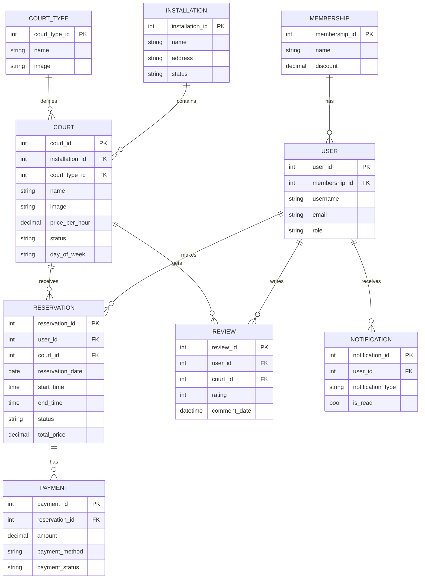

# Diagrama ER del proyecto

Este documento describe el modelo Entidad-Relacion a partir de las entidades definidas en los modulos de la app.

## ER (Mermaid, completo)

```mermaid
erDiagram
    USER {
        int user_id PK
        int membership_id FK nullable
        string username UK
        string name
        string surname
        string email UK
        string phone
        string password
        string role
        bool is_active
        datetime registration_date
        datetime last_login_date
        date date_of_birth
        string address nullable
        string last_ip nullable
        datetime last_time_seen nullable
        text refresh_token_hash nullable
        bool email_verified
        text email_verification_token_hash nullable
        datetime email_verification_expires_at nullable
        text expo_push_token nullable
        text password_reset_token_hash nullable
        datetime password_reset_expires_at nullable
    }

    MEMBERSHIP {
        int membership_id PK
        int level UK
        string name UK
        decimal discount
        int required_reservations
        text benefits nullable
    }

    INSTALLATION {
        int installation_id PK
        string name
        string address
        string phone
        string email
        string description nullable
        date created_at
        string status
        int maxCapacity nullable
        time openingHours nullable
        time closingHours nullable
    }

    COURT_TYPE {
        int court_type_id PK
        string name
        string image
    }

    COURT {
        int court_id PK
        int installation_id FK
        int court_type_id FK
        string name
        string image nullable
        int capacity
        decimal price_per_hour
        bool is_covered
        bool has_lighting
        string description nullable
        string status
        time opening_time
        time closing_time
        string day_of_week
        int reservations_made
        int total_reviews
        decimal average_rating
    }

    RESERVATION {
        int reservation_id PK
        int user_id FK
        int court_id FK
        date reservation_date
        time start_time
        time end_time
        string status
        decimal total_price
        datetime createdAt
        string note nullable
        string verification_code UK nullable
    }

    PAYMENT {
        int payment_id PK
        int reservation_id FK
        decimal amount
        datetime payment_date
        string payment_method
        string payment_status
        string stripe_payment_intent_id nullable
        string stripe_refund_id nullable
        decimal refund_amount nullable
        datetime refund_date nullable
        text note nullable
    }

    NOTIFICATION {
        int notification_id PK
        int user_id FK
        string title nullable
        string message
        string notification_type
        bool is_read
        datetime created_at
    }

    REVIEW {
        int review_id PK
        int user_id FK
        int court_id FK
        string title
        text text
        int rating
        datetime comment_date
        bool is_visible
        text admin_answer nullable
        datetime updated_at
    }

    MEMBERSHIP ||--o{ USER : assigned_to
    USER ||--o{ RESERVATION : makes
    COURT ||--o{ RESERVATION : has
    RESERVATION ||--o{ PAYMENT : generates

    USER ||--o{ NOTIFICATION : receives

    USER ||--o{ REVIEW : writes
    COURT ||--o{ REVIEW : receives

    INSTALLATION ||--o{ COURT : contains
    COURT_TYPE ||--o{ COURT : classifies
```

## Relaciones

1. Membership 1:N User
2. Installation 1:N Court
3. CourtType 1:N Court
4. User 1:N Reservation
5. Court 1:N Reservation
6. Reservation 1:N Payment
7. User 1:N Notification
8. User 1:N Review
9. Court 1:N Review

## Reglas y restricciones importantes

1. User.username es unico.
2. User.email es unico.
3. Reservation.verification_code es unico cuando existe.
4. Review tiene restriccion unica compuesta por user_id y court_id (un usuario no puede duplicar review para la misma pista).
5. Court tiene restriccion unica compuesta por name, installation y day_of_week.

## Notas de enums

1. User.role: GESTOR_RESERVAS, CLIENTE, SUPER_ADMIN, ADMINISTRACION.
2. Installation.status: activa, en_mantenimiento, inactiva.
3. Court.status: DISPONIBLE, MANTENIMIENTO, INACTIVA.
4. Court.day_of_week: LUNES a DOMINGO.
5. Reservation.status: PENDIENTE, CONFIRMADA, CANCELADA, FINALIZADA, NO_PRESENTADO.
6. Payment.payment_method: Visa, MasterCard, PayPal, Bizum, Efectivo.
7. Payment.payment_status: Pagado, No pagado, En proceso, Reembolsado.
8. Notification.notification_type: Aviso, Recordatorio, Alerta, Promocion.

## ER (Mermaid, simplificado para presentacion)


